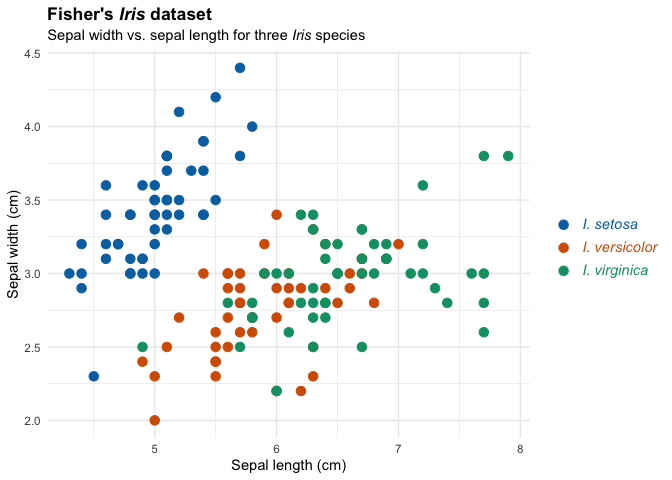
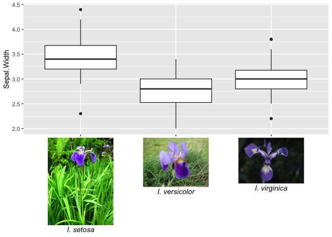
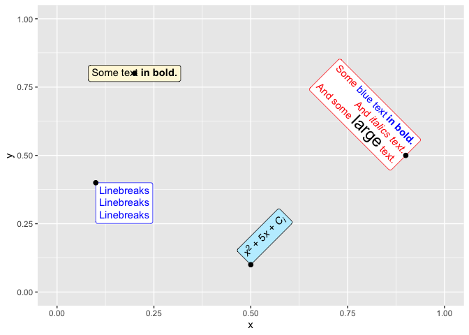
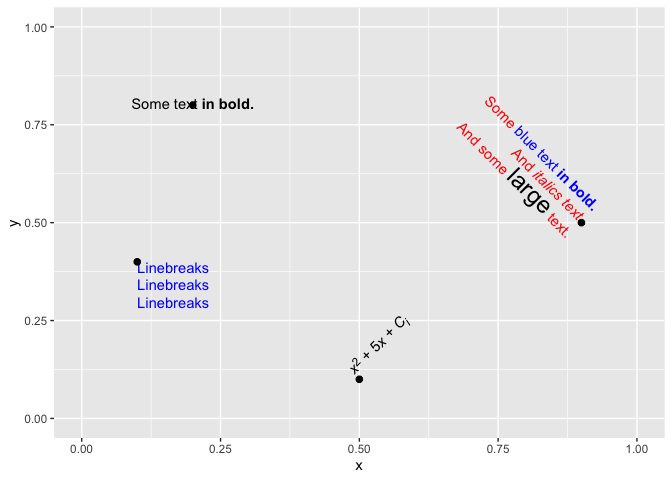

<!-- README.md is generated from README.Rmd. Please edit that file -->

# ggtext

Improved text rendering support for ggplot2, written by Claus O. Wilke

This package provides ggplot2 support for the
[gridtext](https://github.com/clauswilke/gridtext) package, which
implements rich-text (basic HTML and Markdown) rendering for the grid
graphics engine. It is a work in progress. Many obvious features are
missing, and others have bugs or don’t work in corner cases.

## Installation

``` r
devtools::install_github("clauswilke/ggtext")
```

## Examples

Rich text formatting support is provided both in theme elements and via
geoms.

### Markdown in theme elements

The ggtext package defines a new theme element, `element_markdown()`,
which behaves similarly to `element_text()` but renders the provided
text as markdown/html. Note that word wrapping is disabled by
`element_markdown()`. To start a new line, use the `<br>` tag or add two
spaces before the end of a line.

``` r
library(ggplot2)
library(ggtext)

ggplot(iris, aes(Sepal.Length, Sepal.Width, color = Species)) +
  geom_point(size = 3) +
  scale_color_manual(
    name = NULL,
    values = c(setosa = "#0072B2", virginica = "#009E73", versicolor = "#D55E00"),
    labels = c(
      setosa = "<i style='color:#0072B2'>I. setosa</i>",
      virginica = "<i style='color:#009E73'>I. virginica</i>",
      versicolor = "<i style='color:#D55E00'>I. versicolor</i>")
  ) +
  labs(
    title = "**Fisher's *Iris* dataset**  
    <span style='font-size:11'>Sepal width vs. sepal length for three *Iris*
    species</span>",
    x = "Sepal length (cm)", y = "Sepal width (cm)"
  ) +
  theme_minimal() +
  theme(
    plot.title = element_markdown(lineheight = 1.1),
    legend.text = element_markdown(size = 11)
  )
```

<!-- -->

Very basic support for the `` tag exists, and it can be used, for
example, to employ images as axis labels.

``` r
labels <- c(
  setosa = "<br>*I. setosa*",
  virginica = "<br>*I. virginica*",
  versicolor = "<br>*I. versicolor*"
)

ggplot(iris, aes(Species, Sepal.Width)) +
  geom_boxplot() +
  scale_x_discrete(
    name = NULL,
    labels = labels
  ) +
  theme(
    axis.text.x = element_markdown(color = "black", size = 11)
  )
```

<!-- -->

### Geoms

The geom `geom_rich_text()` provides markdown/html labels. Unlike
`geom_label()`, the labels can be rotated.

``` r
df <- data.frame(
  label = c(
    "Some text **in bold.**",
    "Linebreaks<br>Linebreaks<br>Linebreaks",
    "*x*<sup>2</sup> + 5*x* + *C*<sub>*i*</sub>",
    "Some <span style='color:blue'>blue text **in bold.**</span><br>And *italics text.*<br>
    And some <span style='font-size:18; color:black'>large</span> text."
  ),
  x = c(.2, .1, .5, .9),
  y = c(.8, .4, .1, .5),
  hjust = c(0.5, 0, 0, 1),
  vjust = c(0.5, 1, 0, 0.5),
  angle = c(0, 0, 45, -45),
  color = c("black", "blue", "black", "red"),
  fill = c("cornsilk", "white", "lightblue1", "white")
)


ggplot(df) +
  aes(
    x, y, label = label, angle = angle, color = color, fill = fill,
    hjust = hjust, vjust = vjust
  ) +
  geom_rich_text() +
  geom_point(color = "black", size = 2) +
  scale_color_identity() +
  scale_fill_identity() +
  xlim(0, 1) + ylim(0, 1)
```

<!-- -->

Labels without frame or background are also possible.

``` r
ggplot(df) +
  aes(
    x, y, label = label, angle = angle, color = color,
    hjust = hjust, vjust = vjust
  ) +
  geom_rich_text(
    fill = NA, label.color = NA, # remove background and outline
    label.padding = grid::unit(rep(0, 4), "pt") # remove padding
  ) +
  geom_point(color = "black", size = 2) +
  scale_color_identity() +
  xlim(0, 1) + ylim(0, 1)
```

<!-- -->
